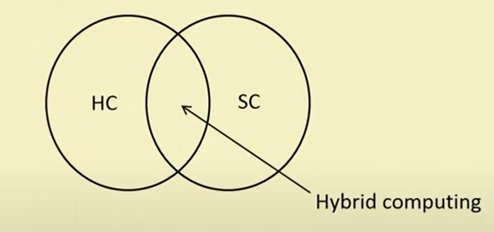

# Week 1

## Lecture 1: Introduction to Soft Computing

### Hard Computing

Hard Computing is based on accurate mathematical models.

Examples:

- Solving numerical problems (roots of polynomials, integration, etc.)
- Searching & Sorting
- Computational Geometry problems (shortest path in a graph, etc.)

### Soft Computing

Soft Computing is based on approximate models, it uses heuristics and to find approximate solutions to problems for which it is almost impossible to find exact solutions.

Its principal constituents are:

- Fuzzy Logic
- Neural Networks
- Probabilistic Reasoning

Role model of Soft Computing: Human Mind

#### Characteristics of Soft Computing

- Not require any mathematical modeling
- May not yeild the precise solution
- Algorithms are adaptive
- Use some biological inspired methodologies such as genetics, evolution, etc.

### Difference b/w Hard Computing & Soft Computing

| Hard Computing                                                                 | Soft Computing                                                         |
| ------------------------------------------------------------------------------ | ---------------------------------------------------------------------- |
| Requires precisely stated analytical model and often a lot of computation time | Tolerant of imprecision, uncertainty, partial truth, and approximation |
| Based on binary logic, crisp systems, numerical analysis and crisp software    | Based on fuzzy logic, neural nets and probabilistic reasoning          |
| Precision and categoricity                                                     | Approximation and dispositionality                                     |
| Deterministic                                                                  | Stochastic                                                             |
| Requires exact input data                                                      | Can deal with ambiguous and noisy data                                 |
| Strictly sequential                                                            | Allows parallel computations                                           |
| Produces precise answers                                                       | Produces approximate answers                                           |

### Hybrid Computing

Combination of the conventional hard computing and emerging soft computing.

