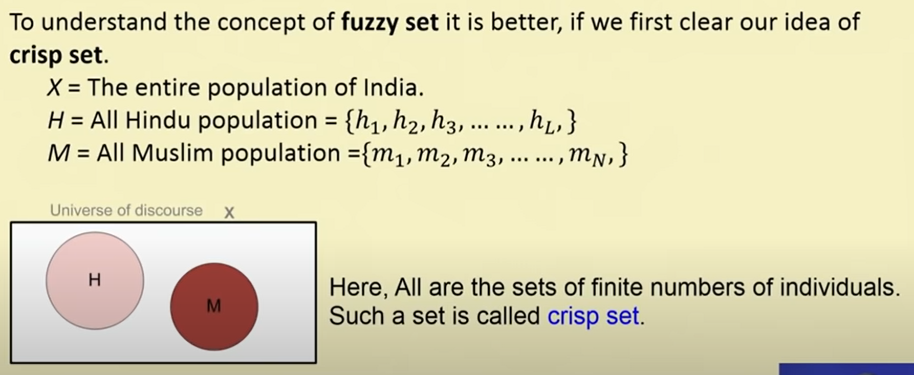
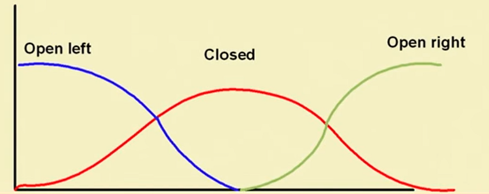

# Week 1

Refer the [PDF](./Week%2001%20Lecture%20Material.pdf)

## Lecture 1: Introduction to Soft Computing

### Hard Computing

Hard Computing is based on accurate mathematical models.

Examples:

- Solving numerical problems (roots of polynomials, integration, etc.)
- Searching & Sorting
- Computational Geometry problems (shortest path in a graph, etc.)

### Soft Computing

Soft Computing is based on approximate models, it uses heuristics and to find approximate solutions to problems for which it is almost impossible to find exact solutions.

Its principal constituents are:

- Fuzzy Logic
- Neural Networks
- Probabilistic Reasoning

Role model of Soft Computing: Human Mind

#### Characteristics of Soft Computing

- Not require any mathematical modeling
- May not yeild the precise solution
- Algorithms are adaptive
- Use some biological inspired methodologies such as genetics, evolution, etc.

### Difference b/w Hard Computing & Soft Computing

| Hard Computing                                                                 | Soft Computing                                                         |
| ------------------------------------------------------------------------------ | ---------------------------------------------------------------------- |
| Requires precisely stated analytical model and often a lot of computation time | Tolerant of imprecision, uncertainty, partial truth, and approximation |
| Based on binary logic, crisp systems, numerical analysis and crisp software    | Based on fuzzy logic, neural nets and probabilistic reasoning          |
| Precision and categoricity                                                     | Approximation and dispositionality                                     |
| Deterministic                                                                  | Stochastic                                                             |
| Requires exact input data                                                      | Can deal with ambiguous and noisy data                                 |
| Strictly sequential                                                            | Allows parallel computations                                           |
| Produces precise answers                                                       | Produces approximate answers                                           |

### Hybrid Computing

Combination of the conventional hard computing and emerging soft computing.

## Lecture 2: Introduction to Fuzzy Logic

### Fuzzy Logic

A mathematical language to express something.

Fuzzy logic deals with Fuzzy set or Fuzzy algebra.

- **Crisp answer**: Yes/No, True/False
- **Fuzzy answer**: May be, May not be, Absolutely, Partially, etc.

### Concept of Fuzzy System

### Example of Crisp Set

### Example of Fuzzy Set

## Difference b/w Crisp Set & Fuzzy Set

| Crisp Set                                                                                 | Fuzzy Set                                                                                                |
| ----------------------------------------------------------------------------------------- | -------------------------------------------------------------------------------------------------------- |
| $S = \{s  \| s \in X\}$                                                                   | $S = \{s, \mu(s) \| s \in X and \mu(s) is the degree of s\}$                                             |
| Collection of elements                                                                    | Collection of ordered pairs                                                                              |
| Inclusion of an element $s \in X$ into $S$ is crisp, i.e., has strict boundary yes or no. | Inclusion of an element $s \in X$ into $F$ is fuzzy, i.e., if present, then with a degree of membership. |

Note: _A crisp set is a fuzzy set, but a fuzzy set is not necessarily a crisp set._  
In case of a crisp set, the elements are with extreme values of degree of membership, i.e., 0 or 1.

### Examples of Fuzzy Set

- High Temperature
- Low Pressure
- Color of Apple
- Sweetness of Orange

### Some Basic Terminologies & Notations

1. **Membership Function (and Fuzzy set)**

   If $X$ is a universe of discourse and $x \in X$, then a fuzzy set $A$ in $X$ is defined as a set of ordered pairs:
   $A = \{(x, \mu_A(x)) | x \in X\}$

   where $\mu_A(x)$ is called the **membership function** of for the fuzzy set $A$.

   **Note**: $\mu_A(x)$ maps each element of $X$ onto a memebership grade (or membership value) in the interval $[0, 1]$.

   Eg:  
   $X$ = All cities in India  
   $A$ = City of comfort  
   $A$ = { (Delhi, 0.8), (Mumbai, 0.9), (Kolkata, 0.7), (Chennai, 0.6) }

2. **Support**

   The support of a fuzzy set $A$ is the set of all points $x$ in $X$ such that **$\mu_A(x) > 0$**.

   $Support(A) = \{x | \mu_A(x) > 0\}$

3. **Core**

   The core of a fuzzy set $A$ is the set of all points $x$ in $X$ such that **$\mu_A(x) = 1$**.

   $Core(A) = \{x | \mu_A(x) = 1\}$

4. **Normality**

   A fuzzy set $A$ is said to be normal if its core is non-empty. In other words, we can always find a point $x \in X$ such that $\mu_A(x) = 1$.

5. **Crossover points**

   The crossover points of a fuzzy set $A$ are the points $x$ in $X$ such that $\mu_A(x) = 0.5$.

   $Crossover(A) = \{x | \mu_A(x) = 0.5\}$

6. **Fuzzy Singleton**

   A fuzzy set whose support is a single point in $X$ with $\mu_A(x) = 1$. That is $|A| = \{x | \mu_A(x) = 1\}$

7. **$\alpha$-cut and strong $\alpha$-cut**

   - The $\alpha$-cut of a fuzzy set $A$ is a crisp set defined as:
     $A_\alpha = \{x | \mu_A(x) \geq \alpha\}$

   - Strong $\alpha$-cut is defined similarly as:
     $A_\alpha' = \{x | \mu_A(x) > \alpha\}$

   **Note**: $Support(A) = A_0', Core(A) = A_1$

8. **Bandwidth**

   Distance b/w the two unique crossover points of a fuzzy set.

   $Bandwidth(A) = |x_1 - x_2|$  
   where, $\mu_A(x_1) = \mu_A(x_2) = 0.5$

9. **Symmetry**

   A fuzzy set $A$ is symmetric if its membership function is symmetric around a certain point $x = c$, namely:

   $\mu_A(x + c) = \mu_A(x - c)$ for all $x \in X$

10. **Open and Closed**

    A fuzzy set $A$ is:

    - **Open left**: if $\lim_{x \to -\infty} \mu_A(x) = 1$ and $\lim_{x \to +\infty} \mu_A(x) = 0$
    - **Open right**: if $\lim_{x \to -\infty} \mu_A(x) = 0$ and $\lim_{x \to +\infty} \mu_A(x) = 1$
    - **Closed**: if $\lim_{x \to -\infty} \mu_A(x) = \lim_{x \to +\infty} \mu_A(x) = 0$

    

### Fuzzy vs. Probability

- **Fuzzy**: When we say about **certainty** of a **thing**
  Example: A patient come to the doctor and he has to diagnose so that medicine can be prescribed.  
  Doctor prescribed a medicine with certainty 60% that the patient is suffering from flue. So, the disease will be cured with certainty of 60% and uncertainty 40%. Here, in stead of flue, other diseases with some other certainties may be.

- **Probability**: When we say about the **chance** of an **event** to **occur**
  Example: India will win the T20 tournament with a chance 60% means that out of 100 matches, India own 60 matches.

### Prediction vs Forecasting

- **Prediction**: Based on best guess from experiences

- **Forecasting**: Based on data you have actually recorded and packed from previous job
