# Week 3

## Lecture 1: Fuzzy Logic Controller Part 1

## Lecture 2: Fuzzy Logic Controller Part 2

## Lecture 3: Fuzzy Logic Controller Part 3

### Takagi and Sugeno's Approach

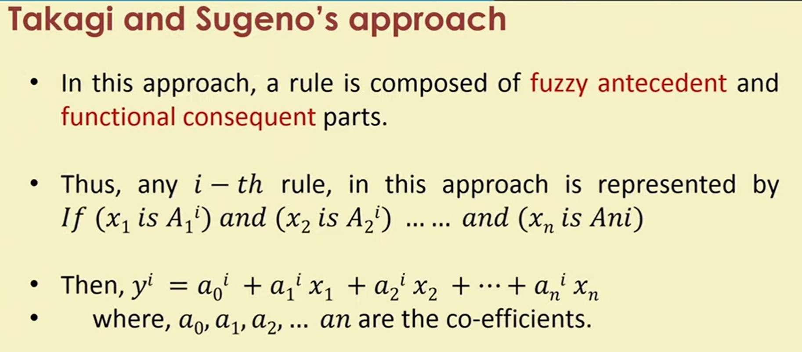

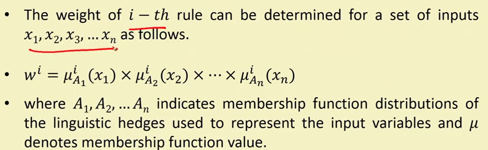

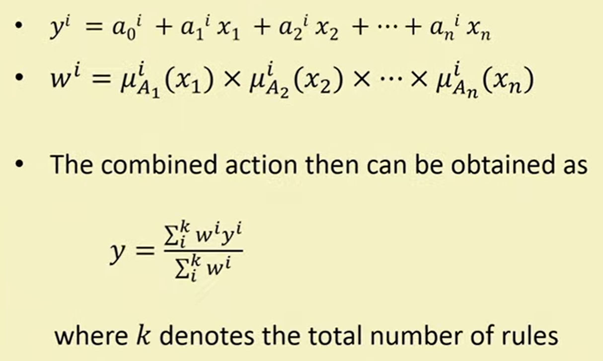

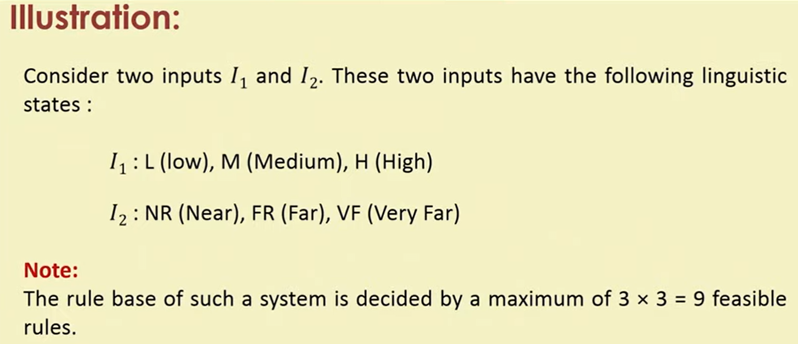

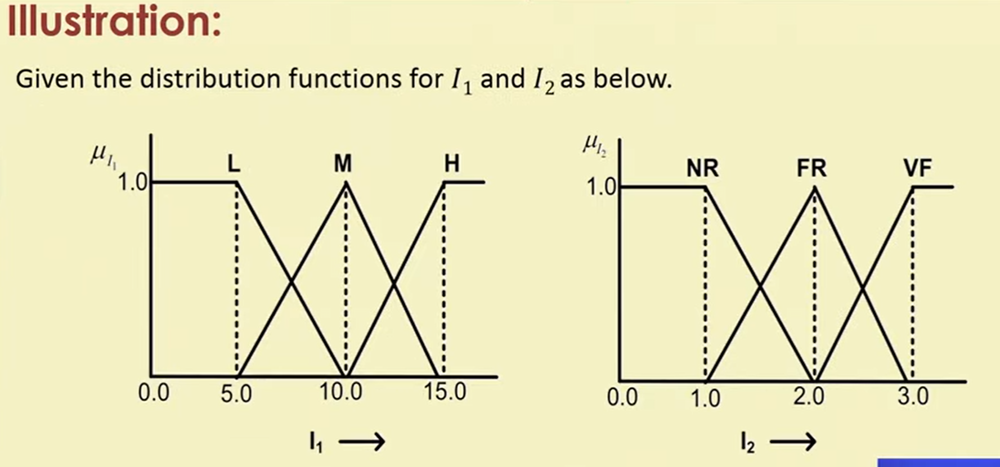

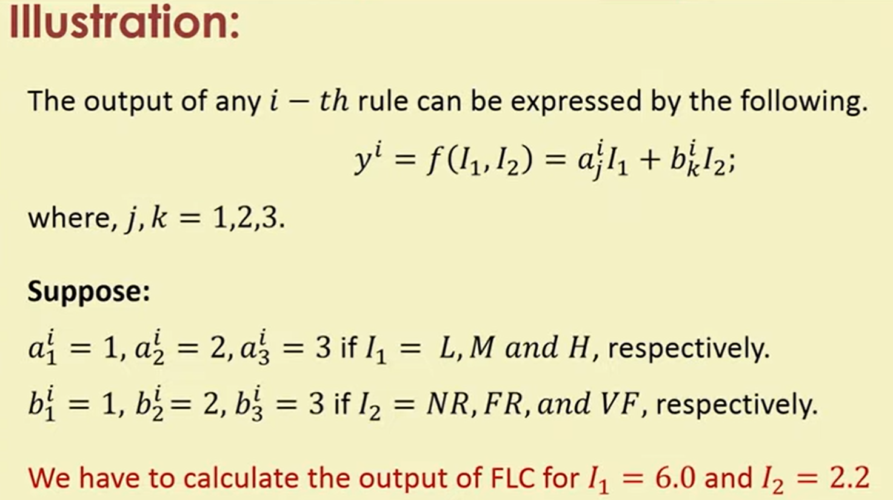

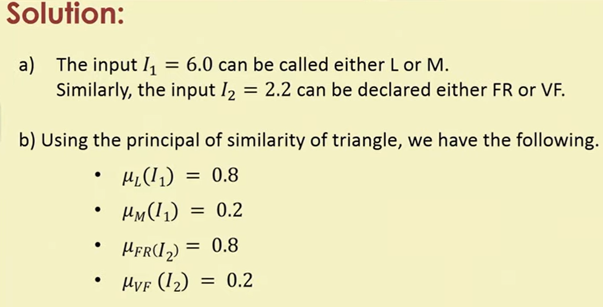

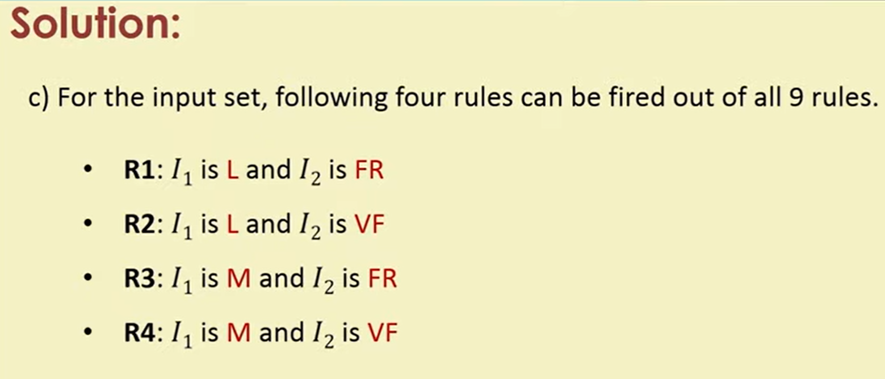

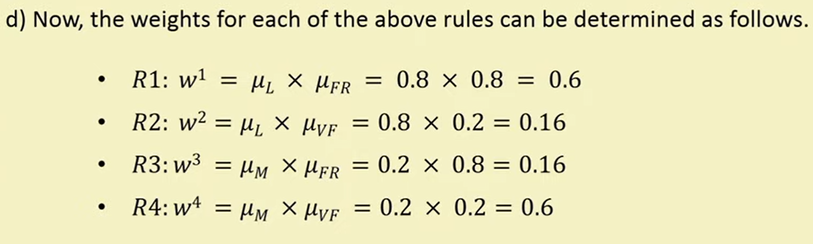

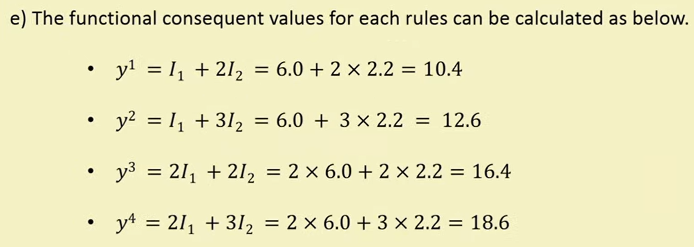

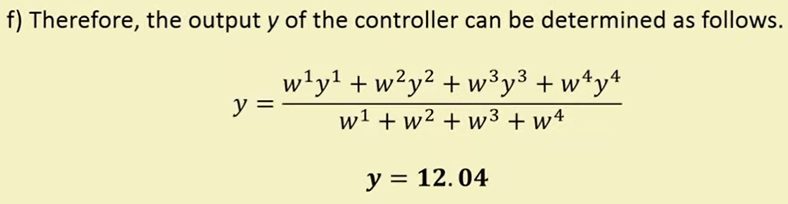

## Lecture 4: Concept of Genetic Algorithm Part 1

## Lecture 5: Concept of Genetic Algorithm Part 2 & GA Strategies
