# Week 4

## Lecture 1: GA Operator: Encoding schemes

## Lecture 2: GA Operator: Encoding schemes (contd.)

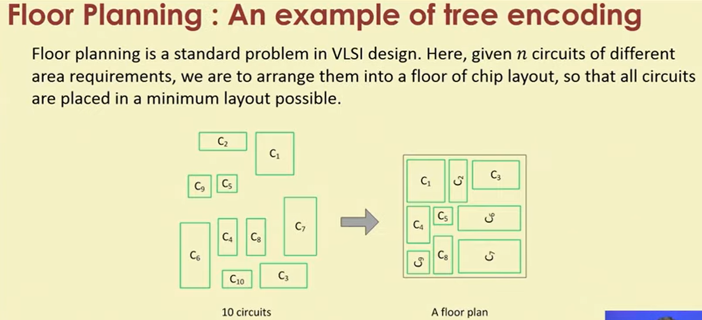

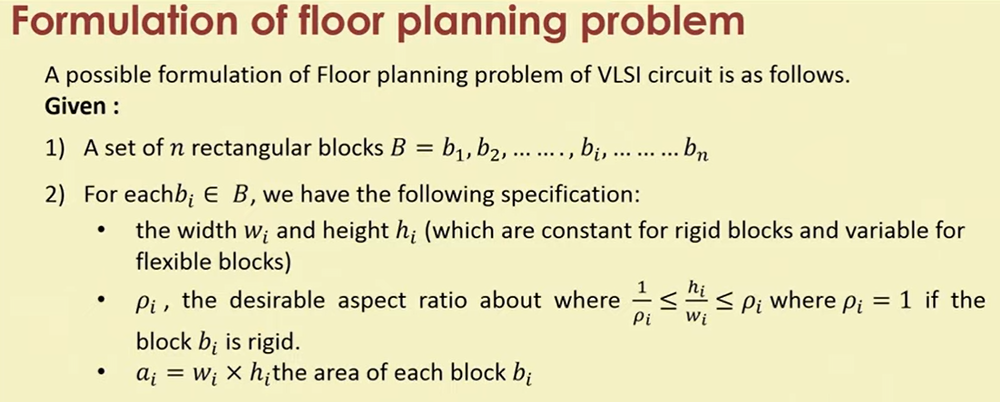

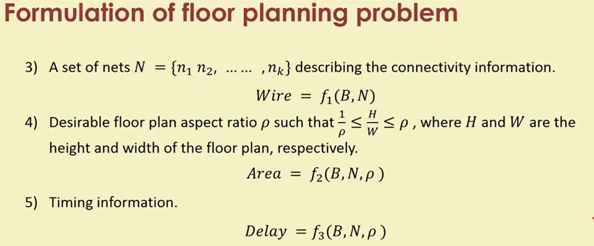

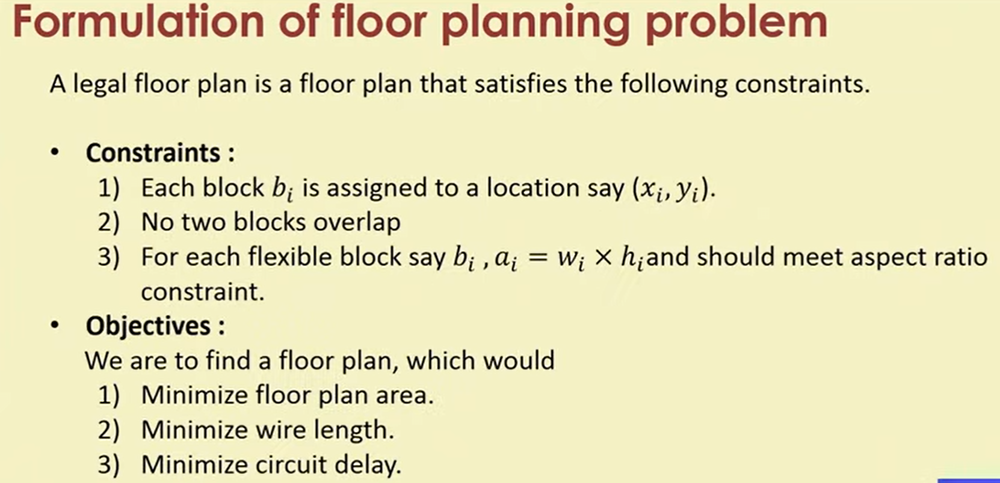

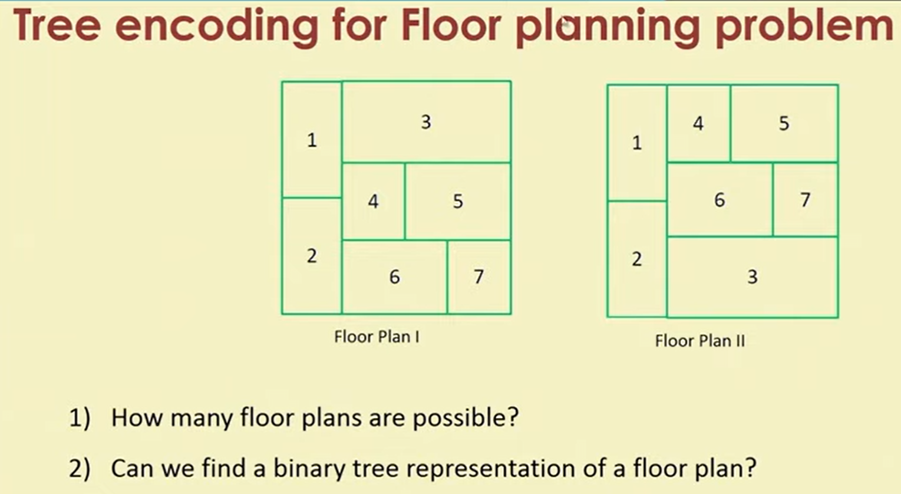

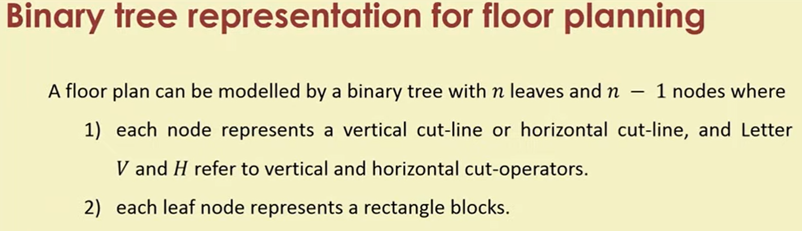

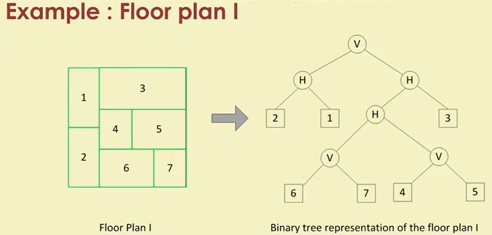

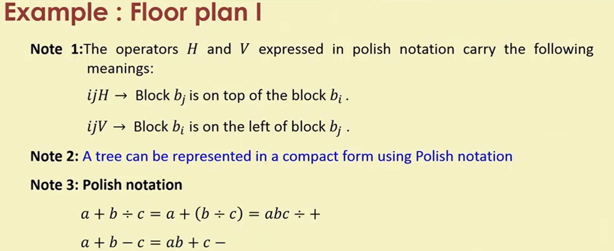

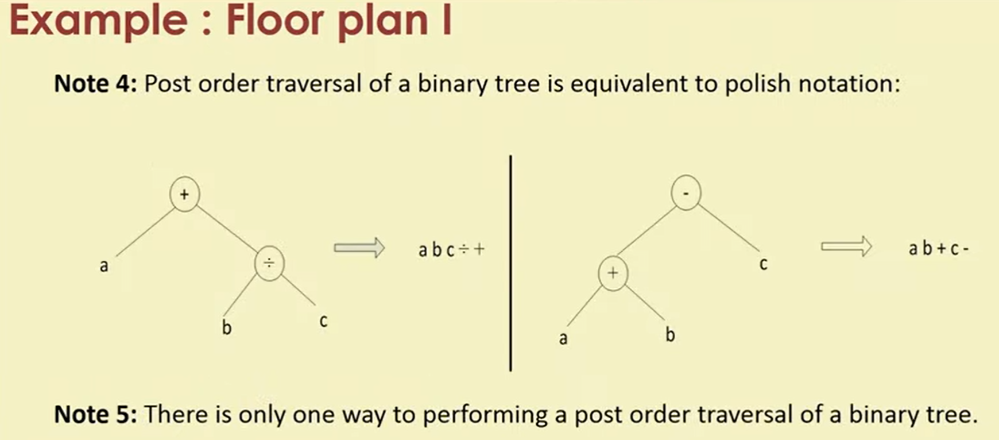

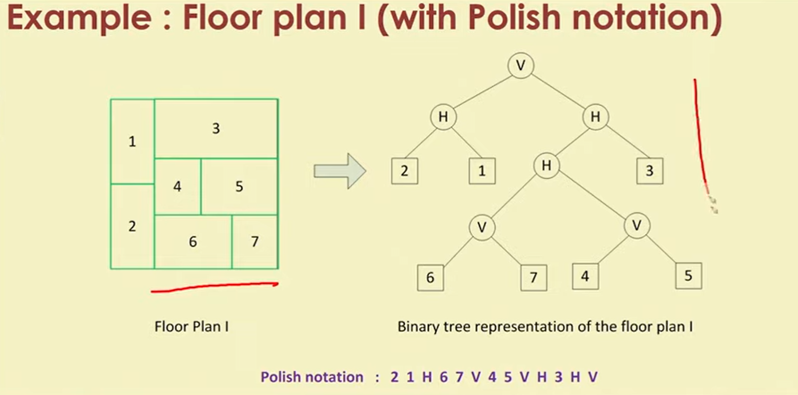

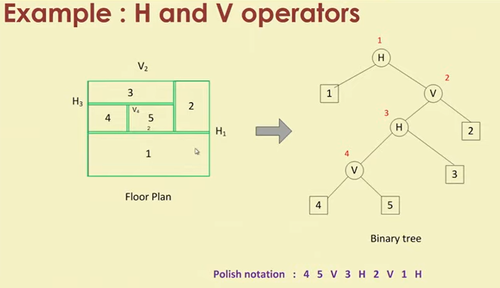

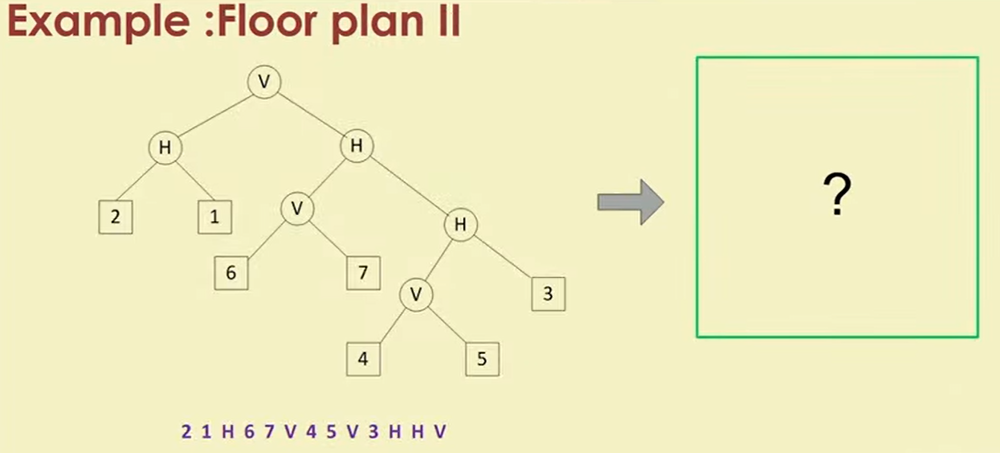

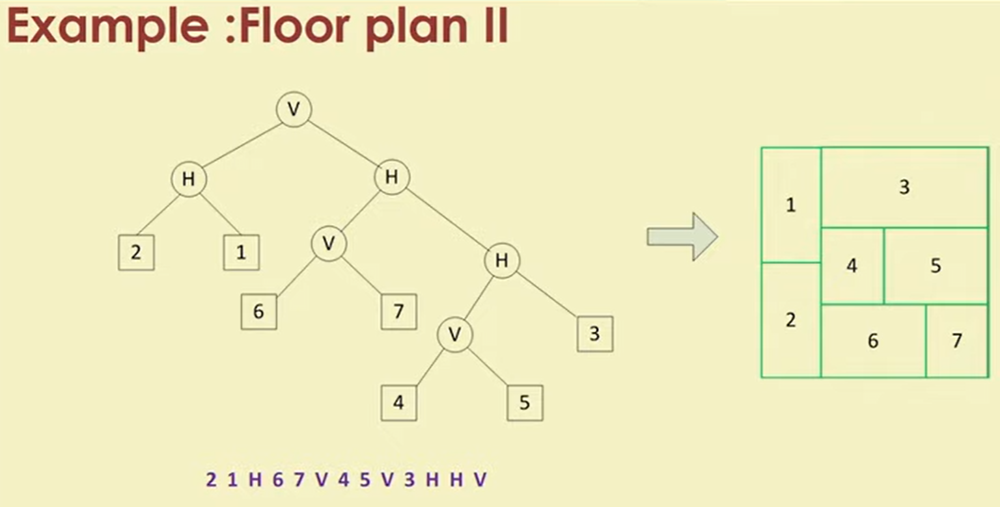

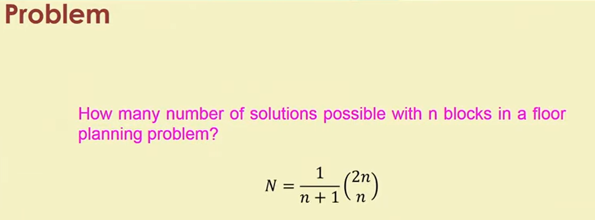

## Lecture 3: GA Operator: Selection

## Lecture 4: GA Operator: Selection (contd.)

## Lecture 5: GA Operator: Crossover techniques
